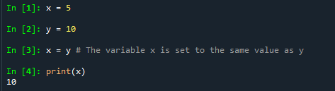

# Foundations of Programming (Python)  

## LAB 02-A: Creating Variables

1.	Create a script using this code:

2.	Verify that the script prints x as “10”.

[Back to Modules Materials Lists](../Modules.md#module-02-materials-list)