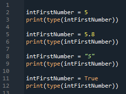

# Foundations of Programming (Python)  

## LAB 02-B: Using the type() function

1.	Create a script using this code:
  
2.	Verify that the script prints:
	`<class 'int'>`  
	`<class 'float'>`  
	`<class 'str'>`  
	`<class 'bool'>`  

[Back to Modules Materials Lists](../Modules.md#module-02-materials-list)