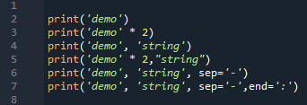

# Foundations of Programming (Python)  

## LAB 02-C: Using the print function

1.	Open Idle and create a script using this code:  
  
2.	Verify that the script prints:  
	`demo`  
	`demodemo`  
	`demo string`  
	`demodemo string`  
	`demo-string`  
	`demo-string:`  

[Back to Modules Materials Lists](../Modules.md#module-02-materials-list)