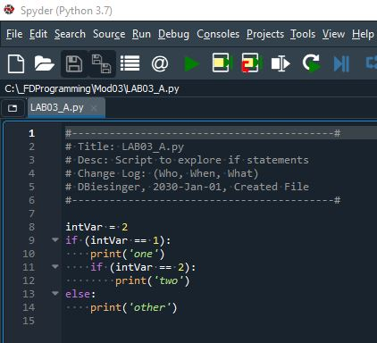

# Foundations of Programming (Python)  

## LAB 03-A: If statements

Create and test a python script using spyder:

1.	Before you type and run this code, think about it and WRITE DOWN what you think the result will be.
2.	Type and run the code.
3.	Is the result the same as what you expected it to be?

[Back to Modules Materials Lists](../Modules.md#module-03-materials-list)