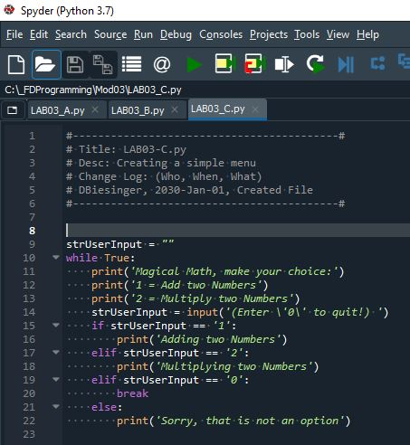

# Foundations of Programming (Python)  

## LAB 03-C: Creating a menu

In this Lab, you’ll create a simple menu:  
  

1.	Type and test the above code.
2.	Is the result the same as what you expected it to be?

[Back to Modules Materials Lists](../Modules.md#module-03-materials-list)