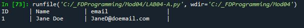

# Foundations of Programming (Python)  

## LAB 04-A: Working with Tuples

In this Lab, you will work with a simple example of a Tuple:    

1.	Create a script that uses a Tuple to hold the following data:  
	1 'Jane Doe' 'JaneD@doemail.com'  
2.	Add code to print out the row of data as shown here:  
  

[Back to Modules Materials Lists](../Modules.md#module-04-materials-list)