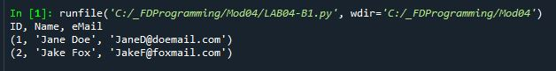
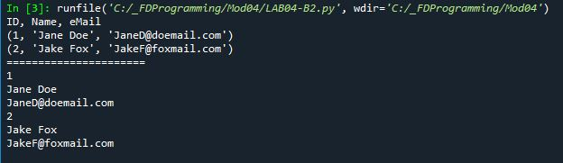

# Foundations of Programming (Python)  

## LAB 04-B: Working with 2D Tuples

In this Lab, you will work with a simple example of a two-dimensional (2D) Tuple.   

1.	Create a script that uses a 2D Tuple to hold the following data:  
	ID Name eMail
	1 'Jane Doe' 'JaneD@doemail.com'  
	2 'Jake Fox' 'JakeF@foxmail.com'  
2.	Create a for loop that prints out each row of the data as shown here:  
  
3. Now modify your script to use a nested for loop to extract the individual element (column) values and “pivot” the presentation of data as shown here:  
  

[Back to Modules Materials Lists](../Modules.md#module-04-materials-list)