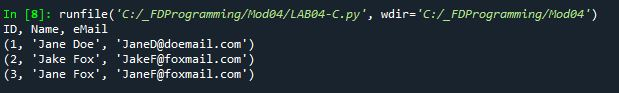

# Foundations of Programming (Python)  

## LAB 04-C: The in Operator

In this Lab, you’ll use the in operator to search thru a 2D Tuple.  

1.	Create a script that uses a 2D Tuple holding the following data:  
	ID Name eMail  
	1 'Jane Doe' 'JaneD@doemail.com'  
	2 'Jake Fox' 'JakeF@foxmail.com'  
	3 'Jane Fox' 'JaneF@foxmail.com'  
2.	Create a for-loop that prints out each row of data:  
 

[Back to Modules Materials Lists](../Modules.md#module-04-materials-list)