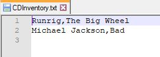

# Foundations of Programming (Python)  

## LAB 05-A: Working with Files and Lists

In this Lab, you’ll be working with lists and files: Complete the starter code to read and write data from list to file.  
We will be re-visiting the CD Inventory application throughout this course. Either use below examples or two of your own to complete this Lab.  

| Artist | Title |
|--------|-------|
| Runrig | The Big Wheel |
| Michael Jackson | Bad |

**Hint:** Use a 2D list to hold the data.

1.	Review the code and make some notes about what it is trying to accomplish.  
2.	Create the starter script as Lab05_A.  
3.	Add to the header  
4.	Replace the TODOs with your solution for the task stated.  
5.	Test your script.  

  

### Example output of the script working:

`runfile('C:/_FDProgramming/Mod05/Lab05_A.py', wdir='C:/_FDProgramming/Mod05')`  
`Write or Read file data.`  

`[a] add data to list`  
`[w] to write data to file`  
`[r] to read data from file`  
`[d] display data`  
`[exit] to quit`  

`a, w, r, d, or exit: a`  

`Enter the CDs Artist: Runrig`  

`Enter the CDs Title: The Big Wheel`  

`[a] add data to list`  
`[w] to write data to file`  
`[r] to read data from file`  
`[d] display data`  
`[exit] to quit`  

`a, w, r, d, or exit: a`  

`Enter the CDs Artist: Michael Jackson`  

`Enter the CDs Title: Bad`  

`[a] add data to list`  
`[w] to write data to file`  
`[r] to read data from file`  
`[d] display data`  
`[exit] to quit`  

`a, w, r, d, or exit: w`  

`[a] add data to list`  
`[w] to write data to file`  
`[r] to read data from file`  
`[d] display data`  
`[exit] to quit`  

`a, w, r, d, or exit: r`  

`[a] add data to list`  
`[w] to write data to file`  
`[r] to read data from file`  
`[d] display data`  
`[exit] to quit`  

`a, w, r, d, or exit: d`  

`Artist, Title`  
`Runrig, The Big Wheel`  
`Michael Jackson, Bad`  

`[a] add data to list`  
`[w] to write data to file`  
`[r] to read data from file`  
`[d] display data`  
`[exit] to quit`  

`a, w, r, d, or exit: exit`  

### Example Text File created:

  

[Back to Modules Materials Lists](../Modules.md#module-05-materials-list)