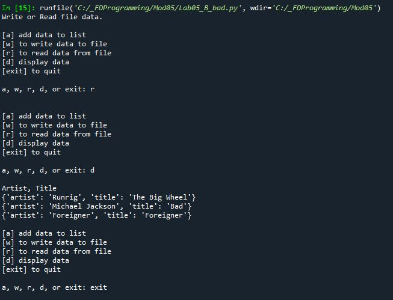

# Foundations of Programming (Python)  

## LAB 05-B: Working with List of Dictionaries

In this Lab, modify the code from Lab 05-A to use dictionaries instead of lists for the rows.  

1.	Make a copy of the LAB05-A solution.  
2.	Replace the inner lists (for the rows) with a dictionary solution.  
3.	Test the script and write down how the code works  
4.	Have a look at this script’s output. Can you think of a way to improve it? Describe what could be done differently and how you would do it.  

  

[Back to Modules Materials Lists](../Modules.md#module-05-materials-list)