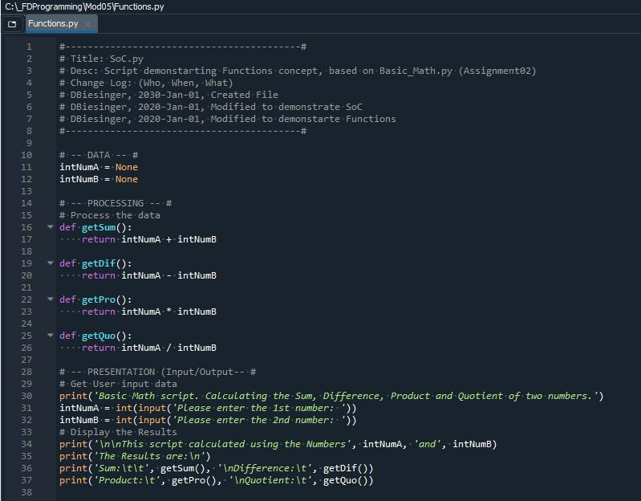

# Foundations of Programming (Python)  

## LAB 06-A: Working with functions   

In this LAB, you create a function each for calculating the Sum, Difference, Product and Quotient of two numbers. Use attributes to pass the values into the functions. And use return values.  

   

1.	Create a script called Lab06_A. Add the above code.  
2.	Modify the script to make it work with attributes and return values.  
3.	Test the script and make sure it works correctly.  
 
[Back to Modules Materials Lists](../Modules.md#module-06-materials-list)  