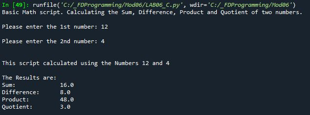

# Foundations of Programming (Python)  

## LAB 06-C: Creating a Class of Functions

In this Lab, we’ll continue with the code from LAB 06-A. You’ll create a class that has our four functions for doing the calculations.  

1.	Make a copy of the script from LAB 06-A and save it as Lab06_C.  
2.	Add code and docstring to create a class called SimpleMath  
3.	Add code and docstring to create a function get_sum  
4.	Add code and docstring to create a function get_diffference  
5.	Add code and docstring to create a function get_product  
6.	Add code and docstring to create a function get_quotient  
7.	Add code for the I/O to capture user input and format your output that it resembles this result:  
  
8.	Test the script and write down how the code works.  

[Back to Modules Materials Lists](../Modules.md#module-06-materials-list)