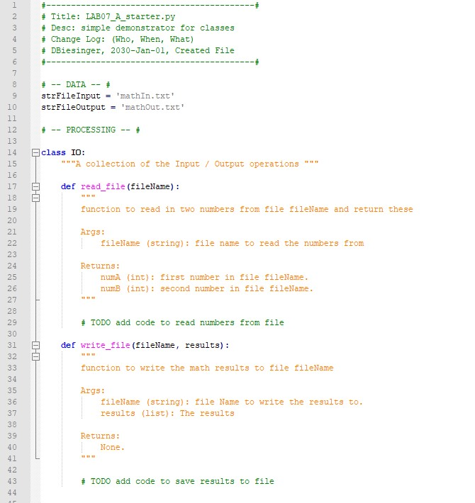
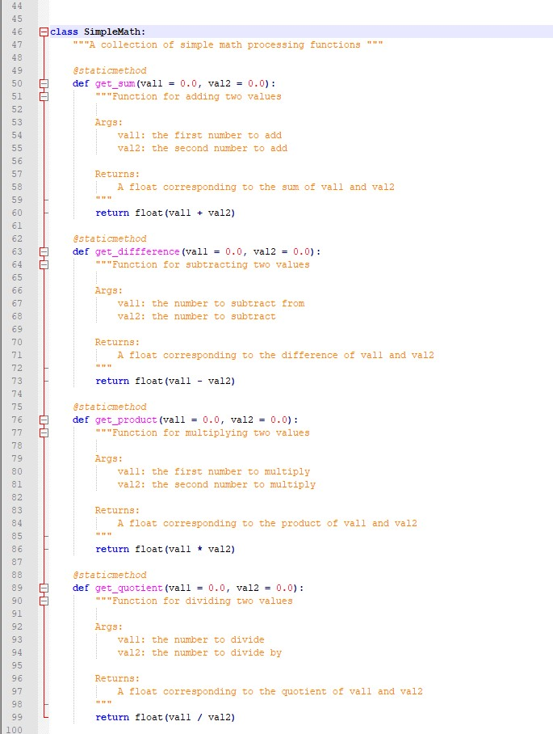
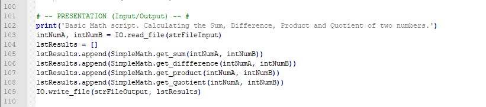

# Foundations of Programming (Python)  

## LAB 07-A: Working with text files    

In this Lab, we’ll continue with the code form Lab 06-C.  
You’ll create a class for I/O and we’ll replace the user input with an input file that has one line with two numbers in it, separated by comma.   
We’ll replace the print output with writing to a file, all four results on one line, separated by commas.  
Do not change the existing code in the SimpleMath class!  

Use these code snippets as your starter script:  
   
   
   

1.	Make a copy of the LAB06_C.py file and save it as LAB07_A. Modify the script to reflect the structure in above sample.  
2.	Add code at the first TODO to read the numbers from a text file.  
3.	Add code at the second TODO to write the result to a text file.  
4.	Test the script and write down how the code works.  
5.	Think about what needed to be changed to handle multiple lines in the input file with two numbers each. (And write the results of the calculations out to the Output file!)  

[Back to Modules Materials Lists](../Modules.md#module-07-materials-list)  
