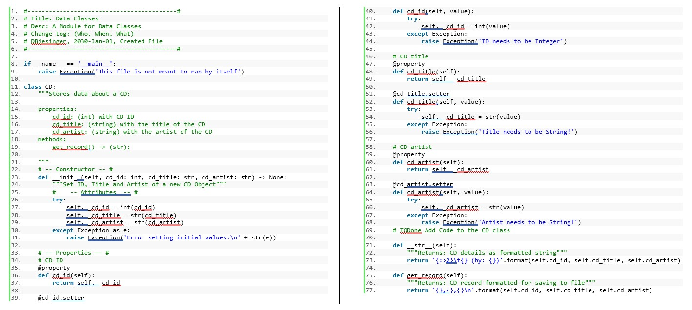
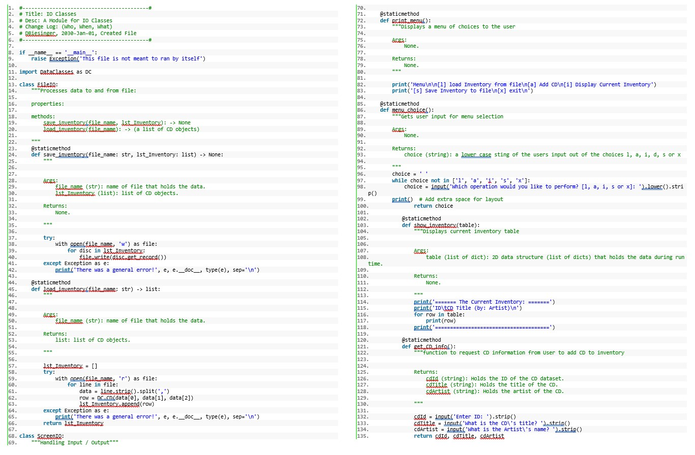
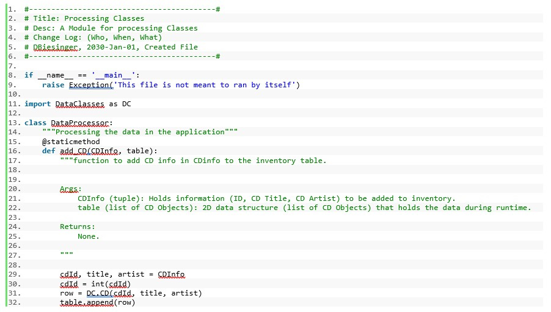

# Foundations of Programming (Python)  

## LAB 09-A:

In this Lab, you’ll create multiple modules that work together. We’ll re-implement the functionality of last module’s assignment using modules. You’ll also add a test harness to test your modules. 
 
**Note:** You do not need to type all the code. You can re-purpose code from last week’s assignment.  

**Important:** create a sub-directory Mod09_A in your _FDProgramming directory for this. (will get important in the next step!)  

1.	Create a script called 'TestHarness.py'  
2.	Create a script module 'DataClasses.py'  
3.	Add the code in this listing to the DataClasses.py script.  
  
4.	Add code to your TestHarness.py script to test your DataClasses.py script  
5.	Create a script module 'IOClasses.py'  
6.	Add the code in this listing to the IOClasses.py script  
  
7.	Add code to your TestHarness.py script to test your IOClasses.py script  
8.	Create a script module 'ProcessingClasses.py'  
9.	Add the code in this listing to the ProcessingClasses.py script  
 
10.	Add code to your TestHarness.py script to test your ProcessingClasses.py script  
11.	Create a script 'CDInventory.py'  
12.	Add code to your script to run the application (former main section)  
13.	Ensure that all test cases in the test harness work  
14.	Ensure that all functionality in the application work.  

**One note about testing:** Make sure to test that the script works as expected (with ‘good’ values).  
But also think about what values to use to test that you can’t break your script.  
These tests typically are more efficient.  

[Back to Modules Materials Lists](../Modules.md#module-09-materials-list)
