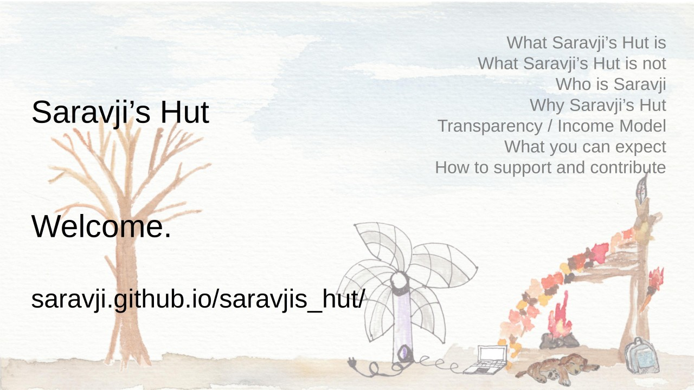

# Saravji's Hut

## What Saravji's Hut is
- A place where knowledge is shared. Everybody is welcome.  
- A project build out of a passion for educating and mentoring.  
- Focused on the Learner.  

## What Saravji's Hut is not
- A place where uncurteous behavior will be tolerated.  
- A place where polarizing and/or divisive comments will be tolerated.
- Focused on the instructor.  
- An attempt to replace primary income.  

## How you can contribute:
- spread the word  
- [subscribe to the YouTube Channel](https://www.youtube.com/channel/UCbHQVBE_i-4FlJUcU7Inl-g?sub_confirmation=1)  
- [follow on twitter](https://twitter.com/intent/follow?screen_name=Saravji) to receive notifications about new uploads and other related news  
- give constructive feedback  

## Available Materials
- [Foundations of Programming (Python)](FDN_Prog/README.md) Learning Path   
- [Collection of Dev Ops Nuggets](dev_ops/README.md)  
- [Feature Selection and Feature Engineering](DS_ML/FS_FE/README.md) Educational Talk  

## Materials in Development
- Version 2 of Foundations of Programming Learning Path:  
    - Foundations of Programming (Python) Intermediary Formats  
    - Foundations of Programming (Python) additional Modules  
- python cheat sheets  

## Planned Materials
- ML / DS: visualizations  
- ML / DS: fundamentals  
- CS: Algorithms  
- Python: web service with django  
- Python for Beginners  
- Python Intermediate  
- git  

## Terms of Use
All materials unless noted otherwise are the intellectual property of Saravji's Hut.  
All materials listed and/or linked as "free" are available to all at no charge. However, this does expressibly excludes downloading and/or permanently saving a copy of the materials in any form or on any medium without express, written consent.  
Links to materials listed and/or linked as "free" are expressibly allowed and encouraged to be shared.  
Materials made available thru any other formats are being made available on an individual basis.  

## Expected Conduct
For the time being, I'll keep comments open on all platforms.  
I expect that everyone treats these areas as a community space and behaves towards others the same way they want to be treated:  
*be courteous, polite and respectful.  
don't talk about religious, political or other polarizing topics.*  
I expressly reserve the option to close down comments. (And no, I will not be spending my time moderating, I rather create content.)

## About Piracy

Effectively, I cannot prevent anyone from pirating or using my works in a way different than intended.  
However, I ask to consider that the materials made available constitute a significant investment. If it would be your efforts / time / monetary contributions, would you not appreciate if folks would show ethical behavior?  
So, why not support and respect the rights?  
