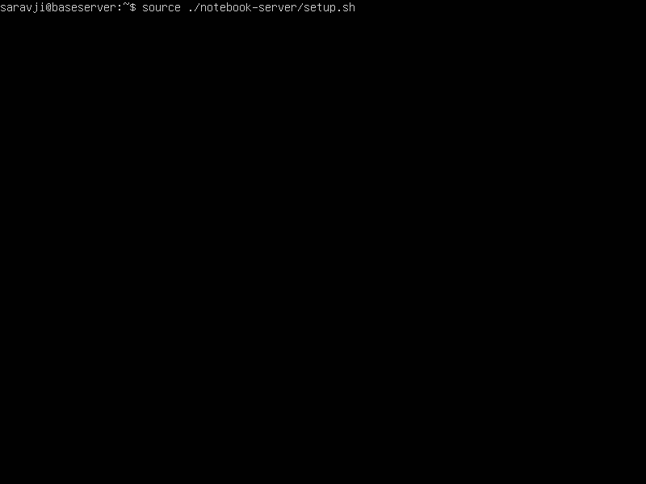

# Installing Anaconda as Saravji's server  

This installation creates a remote accessible jupyter server.  
The installation is based on linux (ubuntu server).  
The repo is available at [github.com/saravji/notebook-server](https://github.com/saravji/notebook-server)

This installation script:  

- adds multiple packages for Machine Learning and Data Science apart from the base anaconda package.  
- adds a number of widgets to jupyter that make life easier. A lot.  
- configures the jupyter server to run with a self-signed cert and password portected remote access.  
- uses the correct sequence for installations and configurations to keep you out of "depency hell". Trust me, been there, done that, don't need it!

## relevant for versions  

- Ubuntu Server 20.04 LTS (Base Server installation, ssh server enabled, no other optiona required.)
- Anaconda 2020.07
- Saravji's notebook-server repo version 2020.10

## Quick Install  

follow Readme at [github.com/saravji/notebook-server](https://github.com/saravji/notebook-server)

## Detailed Install  

### prerequisite:

- Ubuntu server 20.04 LTS installed.
- ssh server installed.
- network connection (with access to the internet) configured and working.

**Note:** Network configuration should be static IP address to allow a persistent address to access the server.
A script to set the ip address static is included in the repo.

### cloning git repo

after successfull deploy of the base server log into the server or VM.

```
    cd ~
    git clone https://github.com/saravji/notebook-server.git
```


### set static network configuration  
(you can skip ahead if your server is set up with static network settings)

find your network interface:
```
    ip addr
```


There will be a loopback entry and a network address.  
Find the adapter name. If it is other than "enp0s3", replace "enp0s3" with your adapter entry.  
There is one locations this needs to happen:  

- in file interfaces, line 3  

Above example shows the ip address as ```192.168.0.108/24``` and the adapter name as ```enp0s3```  

to change / adjust the network settings to your network:

```
    nano ./notebook-server/interfaces
```
this is a .yaml file (with no extension at the moment). Make sure to precisely adhere to the spacing structure.


exit out of nano and save your changes!  

apply the changes:

```
    source ./notebook-server/stat_network.sh
```


**This will reboot your server!!**  

### main installation script:  

you should be able to log into your server via ssh at this point.  

start the main installaition script:  
```
    source ./notebook-server/setup.sh
```




This will kick off the download and installation of anaconda.  

You will be prompted to accept the license agreement:  

(confirm with [ENTER} and keep pressing [ENTER] until you get this view:  


enter ```yes``` to accept the license agreement  

You will be asked for the installation location. Accept the default with [ENTER]:  

  

enter ```yes``` when asked to run conda init:  

  

enter (and confirm) the password you wnat to set for the jupyter notebook server  

  

next enter the certificate information you want to use.  
Also enter the port number jupyter shall answer on.  

  

Next, decide if you also want to install the R kernel (or not):

  

Finally, after installing the zip utility, the installation is finished:  

  

## Usage  

### base usage

In the basic usage, simply start the server with  

```
    jupyter notebook
```

from the terminal.  

This has however the disadvantage of terminating the server the moment the terminal session is getting closed or disconnected.

### suggested usage:

I suggest to use the screen terminal application. This already comes pre-installed with ubuntu server.

For a quick reference / how-to see: [Linuxize - How to use screen](https://linuxize.com/post/how-to-use-linux-screen/)  

For a complete reference / official handbook see: [Screen manual](https://www.gnu.org/software/screen/manual/screen.html)  

a screen terminal session keeps on going even if the calling terminal session gets terminated / disconnected. This means, you can let the jupyter notebook server run independently from your desktop.  

## previous versions

### ubuntu 16.04 LTS and anaconda3-4.4.0

for the previous installation, refer to the git repo at [github.com/saravji/notebook-server](https://github.com/saravji/notebook-server) and follow the bottom part of the README instructions.
