# Installing Anaconda on Linux (Ubuntu)

## Relevant For Version  
anaconda version 2020.07

## Quick Install  

### direct link to installer:
[64-Bit (x86) Installer (550 MB)](https://repo.anaconda.com/archive/Anaconda3-2020.07-Linux-x86_64.sh)

### go-there-yourself:

- browse to [anaconda.com/products/individual](https://www.anaconda.com/products/individual),  

- scroll down to "Anaconda Installers",  

- choose "64-Bit (x86) Installer (550 MB)"  

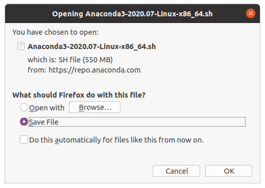

## Detailed Install  
- open terminal  

- enter  

    bash ~/Downloads/Anaconda3-2020.07-Linux-x86_64.sh  
This will start the installation process.  

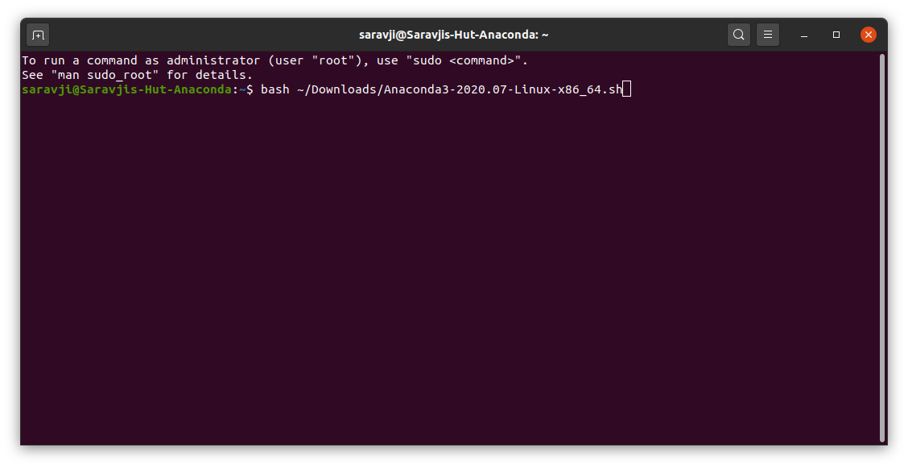

- Next stop license agreement - review:

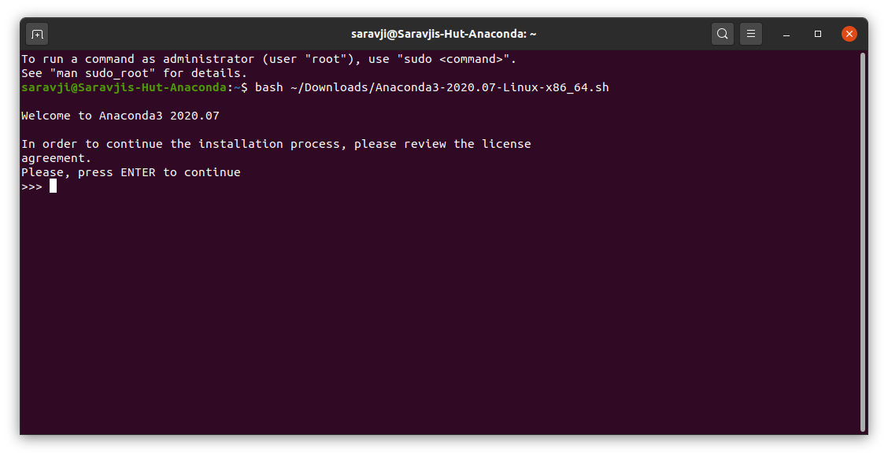

- scroll down to the end of the text (use enter key) and enter "yes" if you agree:

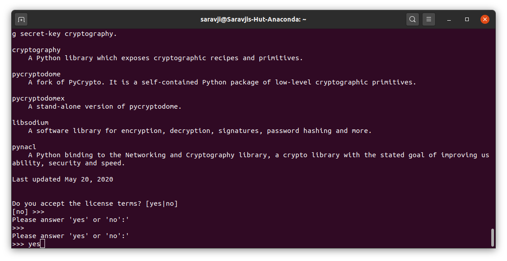

- press enter to confirm location:

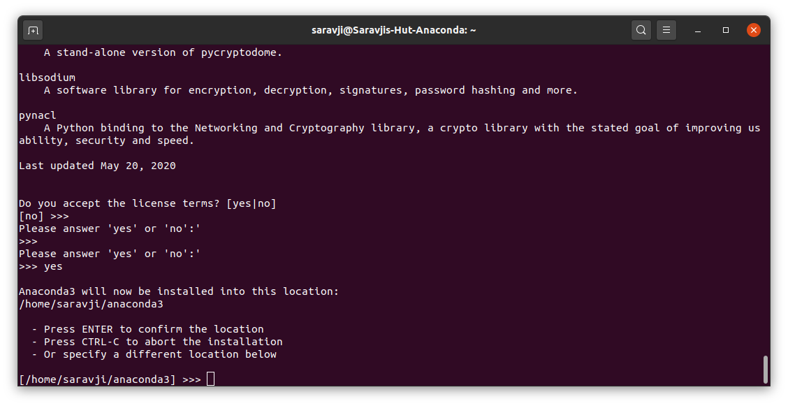

- confirm yes to initialize anaconda:

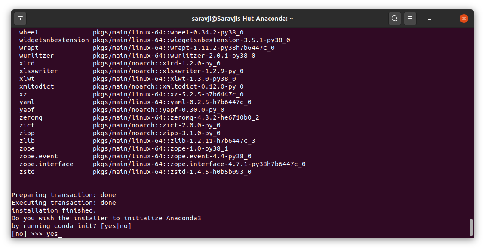

- finished:

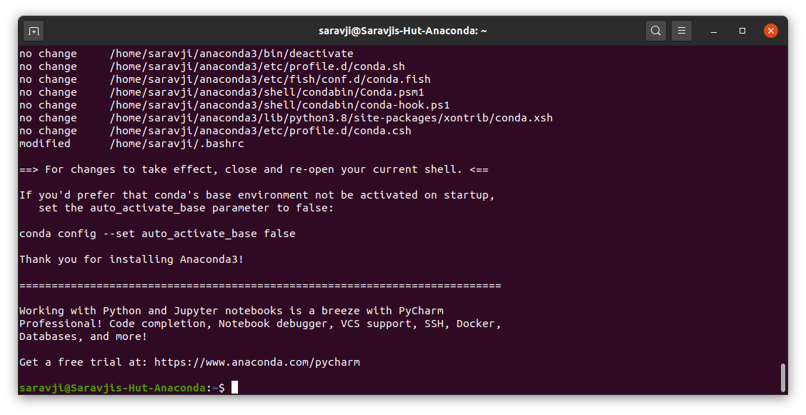

- close your terminal session. to activate the configuration changes, it needs to be closed and re-opened anyhow.

##Verify Installation / Version
- open terminal  
you should se (base) at the beginning of your prompt.  
This means the conda environment is active!  

- type `python --version` to get your python version.  

- type `conda -- version` to get your conda version.  

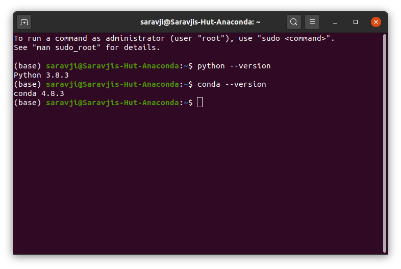

## Configuration  

### add application icon for anaconda navigator:  
(this is optional)  

- open terminal  

`cd .local/share/applications`

`touch anaconda-navigator.desktop`

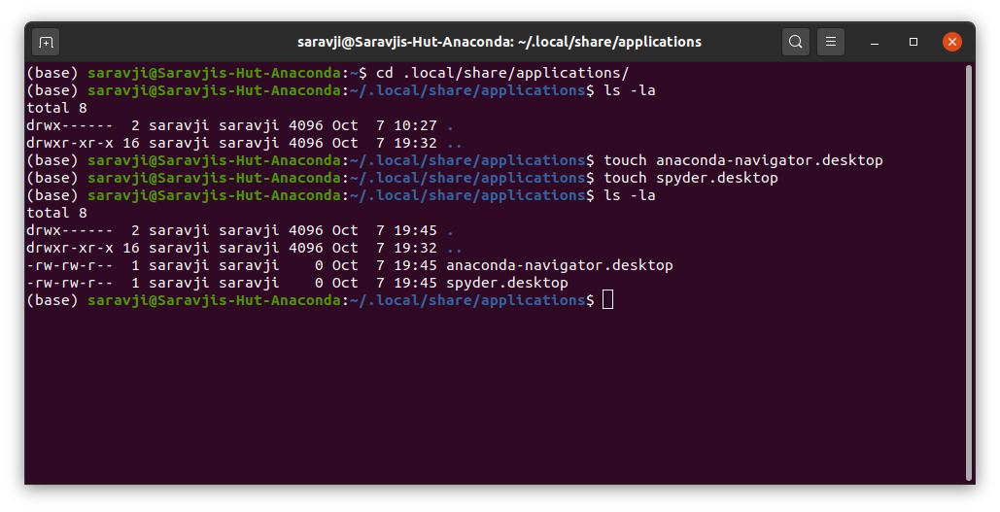

- open files, go to .local/share/applications (if needed, enable "show hidden files")

- open file anaconda-navigator.desktop and add the following. (Replace |your user name| with your actual ubuntu user name.  

    [Desktop Entry]  
    Version=1.0  
    Type=Application  
    Name=Anaconda  
    GenericName=Anaconda Navigator  
    Exec=bash -c 'export PATH="/home/|your user name|/anaconda3/bin:$PATH" && /home/|your user name|/anaconda3/bin/anaconda-navigator'  
    Comment=Scientific Python Development Environment - Python3
    Icon=/home/|your user name|/anaconda3/lib/python3.8/site-packages/anaconda_navigator/static/images/anaconda-icon-256x256.png  
    Terminal=false  
    StartupNotify=true  
    MimeType=text/x-python;  
    Categories=Development;Science;IDE;Qt;Education;  

- the result should look like this:

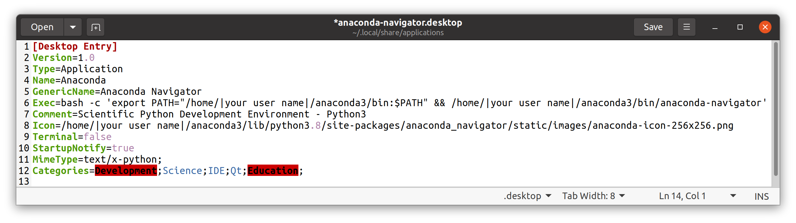

### add application icon for spyder:
(this is optional)  

- open terminal  

`cd .local/share/applications`

`touch spyder.desktop`

- open files, go to .local/share/applications (if needed, enable "show hidden files")

- open file spyder.desktop and add the following. (Replace |your user name| with your actual ubuntu user name.  

    [Desktop Entry]  
    Version=1.0  
    Type=Application  
    Name=Spyder  
    GenericName=Spyder - The Scientific Python Development Environment  
    Exec=bash -c 'export PATH="/home/|your user name|/anaconda3/bin:$PATH" && /home/|your user name|/anaconda3/bin/spyder'  
    Comment=Scientific Python Development Environment - Python3
    Icon=/home/|your user name|/anaconda3/lib/python3.8/site-packages/spyder/images/spyder_dark.png  
    Terminal=false  
    StartupNotify=true  
    MimeType=text/x-python;  
    Categories=Development;Science;IDE;Qt;Education;  

- the result should look like this:

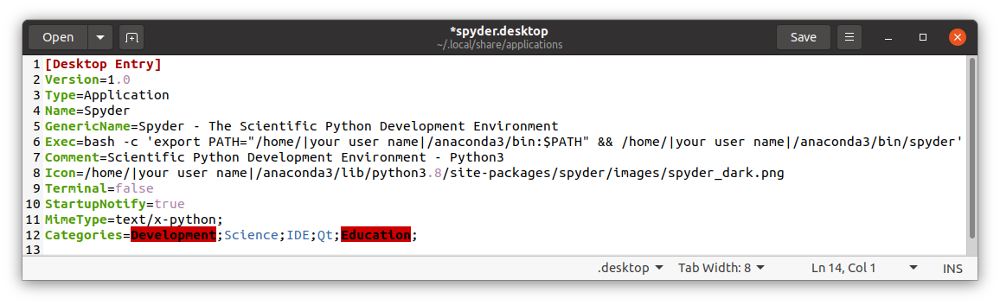

##Version History

once updates to this page are made, the old versions are going to be archived here.  
