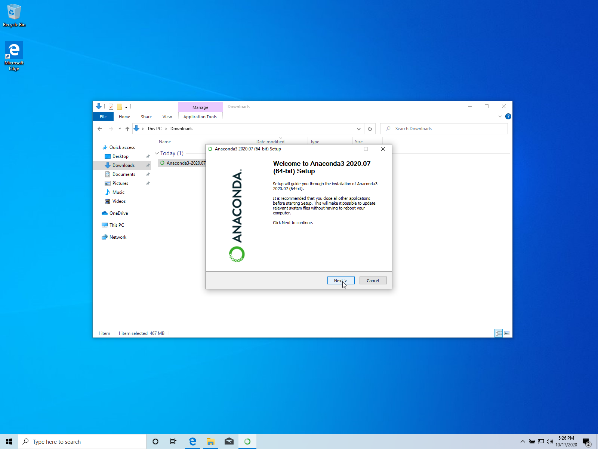
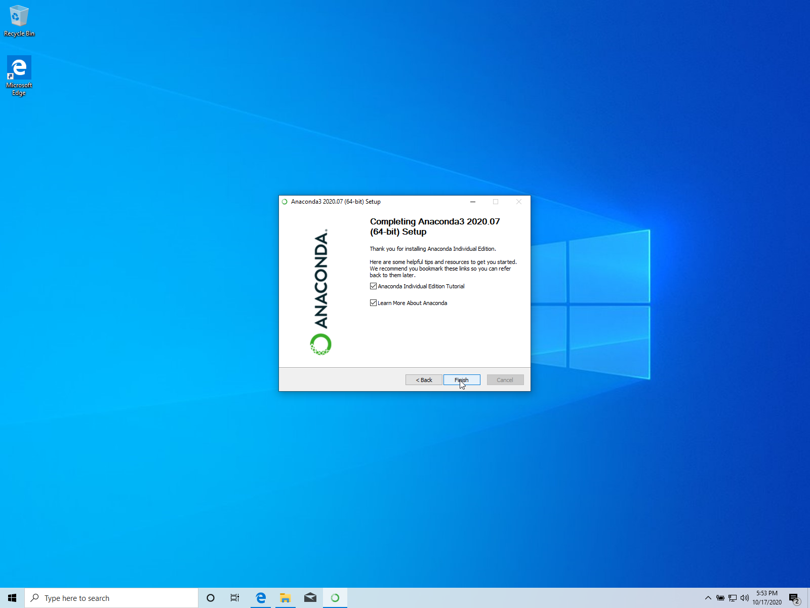

# Installing Annaconda on Windows

## Relevant For Version  

- anaconda version 2020.07
- Windows10 - should work similarily on older versions.

## Quick Install  

### direct link to installer:  

[64-Bit Graphical Installer (466 MB)](https://repo.anaconda.com/archive/Anaconda3-2020.07-Windows-x86_64.exe)

### go-there-yourself:

- browse to [anaconda.com/products/individual](https://www.anaconda.com/products/individual),  


- scroll down to "Anaconda Installers",  


- choose "64-Bit (x86) Installer (550 MB)"  


seelct "save"


## Detailed Install  

- find the downloaded exe in folder "Downloads"


- double-click it, The Anaconda Graphical Installer opens



- click [Next] to run start the setup


- click [I Agree] at License Agreement Screen


- keep selection of "Just Me"
- click [Next] Select Installation Type screen


- keep suggested folder
- click [Next] at Choose Installation Location screen


- keep suggested selection
- click [Install] at Advanced Installation Options screen


- click [Next] on Installation complete screen


- click [Next] at JetBrains / PyCharm IDE screen



- click [Finish] on Completing Anaconda Setup screen

## Configuration  

to verify the installation, open the anaconda prompt


if the prompt line starts with (base), the conda installation worked.  

```
    python --version
```  

should yield you a result as should  

```
    conda --version
```  

  

further, you should have "Anaconda-Navigator" and "Anaconda Prompt" in your start menu:  

  


## Version History

once updates to this page are made, the old versions are going to be archived here.  

